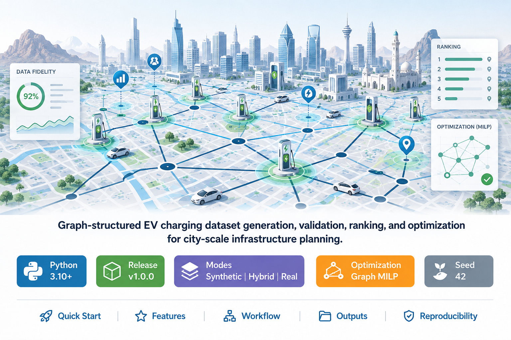

# EVCS Sim-to-Real Planning Suite

<p align="center">
  
</p>

<h1 align="center">Sim-to-Site</h1>

<p align="center">
  <b>A Data-Fidelity-Aware Sim-to-Real Planning Framework for Graph-Based EVCS Placement</b>
</p>

<p align="center">
  <b>Graph-structured EV charging dataset generation, validation, ranking, and optimization for city-scale infrastructure planning.</b>
</p>

<p align="center">
  
  
  
  
  
</p>

<p align="center">
  <a href="#quick-start">Quick Start</a> ·
  <a href="#what-this-release-does">Features</a> ·
  <a href="#system-workflow">Workflow</a> ·
  <a href="#outputs">Outputs</a> ·
  <a href="#reproducibility">Reproducibility</a>
</p>


---

## Release Overview

**EVCS Sim-to-Real Planning Suite** is a research-grade software release for building and evaluating electric vehicle charging station planning datasets across **synthetic**, **hybrid**, and **real** operating modes.

The suite supports two connected workflows:

1. **EV Dataset Generator**  
   Builds graph-structured EV charging datasets from city configurations, road networks, candidate sites, demand indicators, KPIs, provenance metadata, uncertainty metadata, validation statistics, and explainability plots.

2. **Simulator-to-Real Transfer Optimization**  
   Uses generated datasets to train candidate-ranking surrogates, shortlist charging-site candidates, and pass them to a graph-based MILP optimizer for final placement.

The software is designed for reproducible EV infrastructure research in cities across **Saudi Arabia** and **Oman**.

---

## What This Release Does

| Capability | Description |
|---|---|
| **Multi-mode dataset construction** | Generates city-level EVCS datasets in `synthetic`, `hybrid`, and `real` modes. |
| **Graph-structured representation** | Exports road graphs, node features, edge features, candidate-site features, and demand indicators. |
| **Real-data integration** | Uses OpenStreetMap through OSMnx when available and supports API-ready adapters for external EV and population data. |
| **Hybrid fallback logic** | Uses real data first, then records proxy or randomized provenance when real sources are unavailable. |
| **Validation-first design** | Screens graph connectivity, candidate availability, spatial coverage, demand distribution, feature observability, and provenance quality. |
| **Candidate KPI generation** | Produces planning-relevant candidate KPIs without directly selecting final station locations. |
| **Sim-to-real benchmarking** | Tests whether synthetic and hybrid simulator outputs can train rankers that transfer to real-mode planning. |
| **Graph MILP placement** | Performs final station placement through graph-based mixed-integer optimization. |
| **Explainable ranking** | Exports ranked candidate tables and feature-importance summaries. |
| **Publication-ready artifacts** | Produces CSV, XLSX, LaTeX tables, PNG figures, and PDF figures for paper writing. |

---

## System Workflow

```text
City Configuration
        │
        ▼
Road Graph Construction
        │
        ├── Synthetic graph builder
        ├── OSMnx real road graph loader
        └── Hybrid graph builder with real-data fallback
        │
        ▼
Feature and Demand Generation
        │
        ├── Node features
        ├── Edge features
        ├── Candidate-site features
        ├── Demand indicators
        └── Candidate KPIs
        │
        ▼
Provenance, Uncertainty, and Validation
        │
        ├── Real / proxy / synthetic / randomized source flags
        ├── Confidence and uncertainty metadata
        ├── Connectivity checks
        ├── Candidate coverage checks
        └── Demand distribution checks
        │
        ▼
Transfer Optimization
        │
        ├── Full real-mode MILP oracle
        ├── Candidate-level oracle labels
        ├── Synthetic-trained ranker
        ├── Hybrid-trained ranker
        ├── Synthetic→Hybrid ranker
        └── Top-M shortlist + MILP final placement
        │
        ▼
Tables, Figures, Rankings, and Reports
```

---

## Repository Layout

```text
.
├── ev_dataset_generator/
│   ├── src/
│   │   └── run_pipeline.py
│   ├── config/
│   ├── outputs/
│   └── requirements.txt
│
├── sim2real_optimization/
│   ├── run_experiment.py
│   ├── make_dataset_index.py
│   ├── config/
│   │   └── experiment_config.yaml
│   ├── outputs_sim2real/
│   └── requirements.txt
│
├── dataset_index.csv
└── README.md
```

---

## Quick Start

### 1. Create an environment

```bash
python -m venv .venv
source .venv/bin/activate
pip install -r requirements.txt
```

For Windows:

```bash
.venv\Scripts\activate
pip install -r requirements.txt
```

---

### 2. Generate a synthetic dataset

Synthetic mode works offline and is the safest first test.

```bash
cd ev_dataset_generator

python src/run_pipeline.py \
  --city sau_riyadh \
  --mode synthetic \
  --task generate_dataset \
  --seed 42 \
  --output_dir outputs/sau_riyadh_synthetic_seed42
```

---

### 3. Generate a hybrid dataset

Hybrid mode attempts real-data loading first and records proxy or randomized provenance when real sources are unavailable.

```bash
python src/run_pipeline.py \
  --city sau_riyadh \
  --mode hybrid \
  --task generate_dataset \
  --seed 42 \
  --output_dir outputs/sau_riyadh_hybrid_seed42
```

---

### 4. Generate all cities and modes

```bash
python src/run_pipeline.py \
  --all_cities \
  --modes synthetic real hybrid \
  --task generate_dataset \
  --seed 42 \
  --output_dir outputs/all_city_runs
```

---

### 5. Validate an existing dataset

```bash
python src/run_pipeline.py \
  --validate_only \
  --input_dir outputs/sau_riyadh_hybrid_seed42
```

---

## Dataset Index

The optimization pipeline expects a `dataset_index.csv` file:

```csv
city_id,country,data_mode,seed,data_dir
omn_nizwa,Oman,real,42,data/omn_nizwa/real
omn_nizwa,Oman,hybrid,42,data/omn_nizwa/hybrid
omn_nizwa,Oman,synthetic,42,data/omn_nizwa/synthetic
```

Each `data_dir` should contain simulator exports such as:

```text
graph_nodes.csv
graph_edges.csv
candidate_sites.csv
candidate_feature_matrix.csv
candidate_kpis.csv
demand_points.csv
validation_report.json
```

File names with compatible prefixes such as `nodes*.csv`, `edges*.csv`, and `candidate_sites*.csv` are also supported.

---

## Automatic Dataset Index Creation

If all generated datasets are stored under one root directory, create the index automatically:

```bash
python make_dataset_index.py \
  --root data \
  --output dataset_index.csv \
  --seed 42
```

Check the generated CSV before running optimization.

---

## Run Sim-to-Real Transfer Optimization

```bash
python run_experiment.py \
  --dataset-index dataset_index.csv \
  --output-dir outputs_sim2real \
  --config config/experiment_config.yaml
```

For debugging without sensitivity analysis:

```bash
python run_experiment.py \
  --dataset-index dataset_index.csv \
  --output-dir outputs_debug \
  --config config/experiment_config.yaml \
  --skip-sensitivity
```

---

## Core Methods

The release evaluates the following planning and transfer methods:

| Method | Role |
|---|---|
| **Random top-M + MILP** | Random shortlist baseline followed by graph optimization. |
| **KPI top-M + MILP** | KPI-ranked shortlist followed by graph optimization. |
| **Greedy graph coverage** | Fast graph-coverage baseline. |
| **Synthetic-trained ranker + top-M MILP** | Ranker trained on synthetic data and evaluated on real-mode planning. |
| **Hybrid-trained ranker + top-M MILP** | Ranker trained on hybrid data and evaluated on real-mode planning. |
| **Synthetic→Hybrid ranker + top-M MILP** | Transfer ranker trained sequentially across synthetic and hybrid modes. |
| **Full real-mode MILP oracle** | Upper-bound reference solved directly on real-mode data. |

---

## Outputs

### Dataset Generator Output

Each dataset-generation run creates:

```text
csv/
plots/
graph/
reports/
```

The main ML-ready file is:

```text
csv/candidate_feature_matrix.csv
```

Typical exported files include:

| Output | Purpose |
|---|---|
| `csv/candidate_feature_matrix.csv` | Candidate-level feature table for ML and ranking. |
| `csv/candidate_kpis.csv` | Candidate-level planning KPIs. |
| `csv/demand_points.csv` | Demand-node or demand-zone indicators. |
| `csv/validation_metrics.csv` | Connectivity, coverage, and quality checks. |
| `reports/validation_report.json` | Structured validation summary. |
| `plots/*.png` | Dataset diagnostics and explainability visualizations. |
| `graph/*` | Road-network graph exports. |

### Optimization Output

The transfer-optimization pipeline exports:

```text
outputs_sim2real/
├── metadata/
├── oracle/
├── labels/
├── rankings/
├── transfer/
├── tables/
└── figures/
```

| Folder | Content |
|---|---|
| `metadata/` | Dataset inventory and validation summaries. |
| `oracle/` | Full real-mode MILP oracle results. |
| `labels/` | Candidate-level oracle labels. |
| `rankings/` | Ranked candidate lists for all methods. |
| `transfer/` | Selected sites and transfer metrics. |
| `tables/` | CSV, XLSX, and LaTeX tables. |
| `figures/` | PNG and PDF figures. |

---

## Real, Hybrid, and Synthetic Modes

### Synthetic Mode

Synthetic mode works offline and creates controlled EVCS planning instances using configured city archetypes, graph builders, candidate sampling, demand generation, and randomized feature construction.

Use this mode for:

- Fast debugging
- Controlled ablation studies
- Fixed-seed reproducibility checks
- Synthetic pretraining experiments

### Real Mode

Real mode uses OSMnx when installed and when internet access is available. It downloads OpenStreetMap road graphs and can ingest OSM-derived geometry.

Adapters are included for WorldPop and OpenChargeMap-style sources. When the required local files or API responses are unavailable, real-mode completeness depends on the available sources.

Use this mode for:

- Real city graph construction
- Final benchmark evaluation
- Full real-mode MILP oracle generation
- Candidate-label extraction for transfer evaluation

### Hybrid Mode

Hybrid mode uses real data when available, then falls back to proxy, synthetic, or randomized values for missing features. The pipeline records the source of each feature through provenance metadata.

Use this mode for:

- Realistic simulator training
- Missing-data robustness experiments
- Synthetic-to-real transfer studies
- Data-quality-aware planning analysis

---

## Validation and Provenance

Each generated instance is checked before optimization. The validation layer covers:

- Road-graph connectivity
- Candidate-site availability
- Candidate spatial coverage
- Demand-node distribution
- Feature observability
- Source provenance
- Confidence and uncertainty metadata

Connectivity metrics are exported in:

```text
csv/validation_metrics.csv
```

Key fields include:

```text
component_count
is_connected
isolated_node_count
connectivity_pass
largest_connected_component_ratio
```

For real and hybrid modes, the graph builder keeps the largest connected component and applies `real_max_nodes` through network-distance expansion from the city center. This avoids arbitrary node slicing and reduces disconnected road islands in map outputs.

---

## Reproducibility

This release uses a fixed seed by default:

```text
seed = 42
```

For reproducible experiments, keep the following fixed:

| Parameter | Recommended Value |
|---|---|
| Random seed | `42` |
| Dataset modes | `synthetic`, `hybrid`, `real` |
| Dataset index | Version-controlled `dataset_index.csv` |
| Config file | Version-controlled YAML |
| Output folder | Separate folder per experiment |
| Sensitivity flag | Use `--skip-sensitivity` only for debugging |

---

## Failure Handling

The optimization pipeline is designed to keep experiments executable.

If the MILP solver fails or reaches the time limit:

1. The solver status is recorded.
2. The failed case is marked in the output tables.
3. A greedy graph-coverage fallback can be used depending on the experiment configuration.

This makes failed optimization cases visible instead of silently hiding them.

---

## Important Design Rule

Candidate inclusion scores and candidate KPIs are exported as dataset features or labels.

They are **not** used to directly choose final station placements inside the dataset generator.

Final placement is handled separately by the optimization pipeline using graph-based planning methods.

---

## Example End-to-End Run

```bash
# 1. Generate all city-mode datasets
cd ev_dataset_generator

python src/run_pipeline.py \
  --all_cities \
  --modes synthetic real hybrid \
  --task generate_dataset \
  --seed 42 \
  --output_dir outputs/all_city_runs

# 2. Build dataset index
cd ../sim2real_optimization

python make_dataset_index.py \
  --root ../ev_dataset_generator/outputs/all_city_runs \
  --output dataset_index.csv \
  --seed 42

# 3. Run transfer optimization
python run_experiment.py \
  --dataset-index dataset_index.csv \
  --output-dir outputs_sim2real \
  --config config/experiment_config.yaml
```

---

## Suggested Paper Mapping

| Software Component | Paper Section |
|---|---|
| Dataset generator | Dataset construction / experimental setup |
| Mode-specific generation | Synthetic, hybrid, and real data construction |
| Provenance metadata | Data fidelity and source reliability |
| Validation metrics | Dataset quality screening |
| MILP oracle | Optimization benchmark |
| Ranker training | Simulator-to-real transfer learning |
| Transfer metrics | Experimental results |
| Feature importance | Explainability analysis |
| Sensitivity outputs | Robustness analysis |

---

## Citation

If you use this framework, dataset generator, or experimental pipeline in your research, please cite:

```bibtex
@misc{khan2026simtosite,
  title        = {Sim-to-Site: A Data-Fidelity-Aware Sim-to-Real Planning Framework for Graph-Based EVCS Placement},
  author       = {Khan, Ajmal and Suleman, Ahmad},
  year         = {2026},
  note         = {Manuscript under preparation}
}
```

---

## License

Add the project license before public release.

Recommended options:

- `MIT` for open academic use
- `Apache-2.0` for permissive use with explicit patent terms
- Institution-specific license for controlled research distribution

---

## Release Checklist

Before publishing this repository, verify that:

- [ ] `requirements.txt` is complete.
- [ ] `dataset_index.csv` example paths match the repository layout.
- [ ] All default config files run without manual edits.
- [ ] Synthetic mode works offline.
- [ ] Hybrid mode records provenance for missing data.
- [ ] Real mode gracefully reports missing internet or source files.
- [ ] Output folders are excluded from version control unless intentionally released.
- [ ] Figures and LaTeX tables are generated successfully.
- [ ] License and citation metadata are finalized.

---

<p align="center">
  <b>Built for reproducible EV charging infrastructure planning research.</b>
</p>
